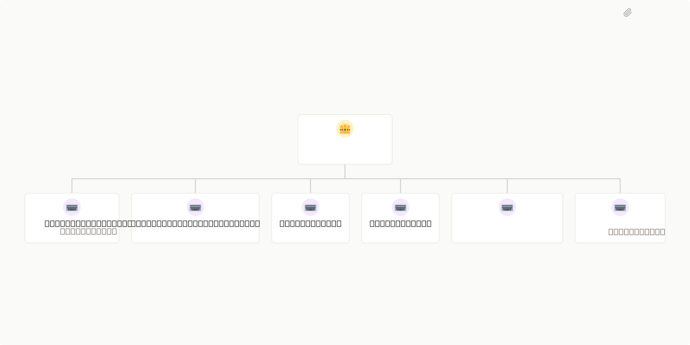

# QA Automation Labs



## What's Inside

> This is an [Agent Company](https://agentcompanies.io) package from [Paperclip](https://paperclip.ing)

| Content | Count |
|---------|-------|
| Agents | 7 |
| Projects | 2 |
| Skills | 4 |

### Agents

| Agent | Role | Reports To |
|-------|------|------------|
| API Testing Agent | Engineer | qa-coverage-agent |
| Cypress Feasibility Agent | Engineer | qa-coverage-agent |
| GitHub Agent | Engineer | qa-coverage-agent |
| QA Coverage Agent | CEO | — |
| Runner Agent | Engineer | qa-coverage-agent |
| Test Generation Agent | Engineer | qa-coverage-agent |
| Validation Agent | Engineer | qa-coverage-agent |

### Projects

- **Hyperswitch**
- **Onboarding**

### Skills

| Skill | Description | Source |
|-------|-------------|--------|
| paperclip-create-agent | > | [github](https://github.com/paperclipai/paperclip/tree/master/skills/paperclip-create-agent) |
| paperclip-create-plugin | > | [github](https://github.com/paperclipai/paperclip/tree/master/skills/paperclip-create-plugin) |
| paperclip | > | [github](https://github.com/paperclipai/paperclip/tree/master/skills/paperclip) |
| para-memory-files | > | [github](https://github.com/paperclipai/paperclip/tree/master/skills/para-memory-files) |

## Getting Started

```bash
pnpm paperclipai company import this-github-url-or-folder
```

See [Paperclip](https://paperclip.ing) for more information.

---
Exported from [Paperclip](https://paperclip.ing) on 2026-04-22
